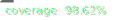

# React Material

React Material is a component library that is built based on the principles of the Material 3 design system.

## Components

* Actions
  * __Button__
  * __IconButton__
  * FloatActionButton (__coming soon__)
  * _SegmentedButton (planning)_
* Communication
  * _Badges (planning)_
  * _Pregress (planning)_
  * Snackbar (__coming soon__)
  * Tooltip (__partially available with IconButton__)
  * _RichTooltip (planning)_
* Containment
  * BottomSheet (__coming soon__)
  * Card (__coming soon__)
  * _Carousel (planning)_
  * Dialog (__coming soon__)
  * Divider (__coming soon__)
  * List (__coming soon__)
  * SideSheet (__coming soon__)
* Navigation
  * __Appbar__
  * __Navbar__
  * Navdrawer (__coming soon__)
  * __Navrail__
  * Tabs (__coming soon__)
* Selection
  * Checkbox (__coming soon__)
  * Chip (__coming soon__)
  * _DatePicker (planning)_
  * Menu (__coming soon__)
  * RadioButton (__coming soon__)
  * _Slider (planning)_
  * Switch (__coming soon__)
  * _TimePicker (planning)_
* Form
  * Search (__coming soon__)
  * SelectField (__coming soon__)
  * TextField (__coming soon__)
* Layout
  * __Grid__
  * __Flexbox__
